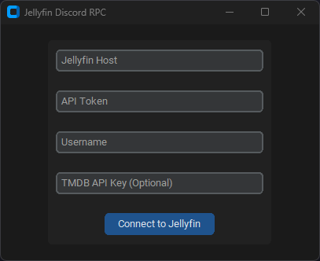

# Discord RPC for Jellyfin


## Installation
- Download [Latest Release](https://github.com/kennethsible/jellyfin-rpc/releases) (**Recommended**)
- Build from Source (for Development)
   1. Install [Python](https://www.python.org/downloads/) and [Poetry](https://python-poetry.org/docs/#installation)
   2. Create Python Environment<br>`poetry install`
   3.  Activate Python Environment<br>`poetry shell`
   4.  Build Executable<br>`pyinstaller main.spec`

## Configuration
Use GUI or `jellyfin_rpc.ini`
- Jellyfin Host
- API Token
- Username
- TMDB API Key (Optional)

Note, movie/series posters **require** a [TMDB](https://www.themoviedb.org/?language=en-US) API Key.

## Usage (GUI)


Note, the application will start **minimized** in the system tray.


## Usage (CLI)
```
jellyfin_rpc.py [-h] [--ini-config INI_CONFIG] [--refresh-rate REFRESH_RATE]
```
