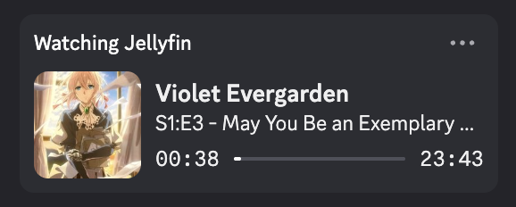
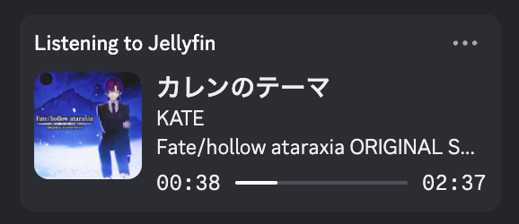
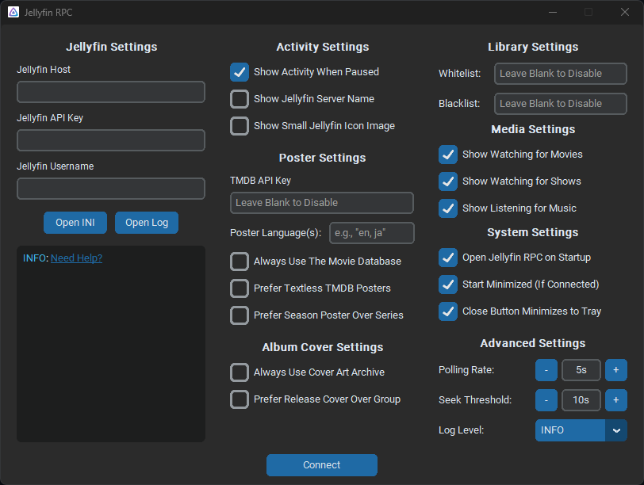

<!-- markdownlint-disable MD033 MD041 -->
# Discord RPC for Jellyfin

Jellyfin RPC updates your Discord status with what you're watching or listening to on your Jellyfin server. Make sure your Discord client is open and that your [Activity Privacy](https://support.discord.com/hc/en-us/articles/7931156448919-Activity-Sharing-on-Discord-FAQ) settings are configured correctly.

<p display="flex" align="center">
  
  
</p>

## Installation

- For Windows and macOS, download the [latest release](https://github.com/kennethsible/jellyfin-rpc/releases) for the GUI.
- For Linux, use [pip](https://www.google.com/url?sa=t&source=web&rct=j&opi=89978449&url=https://pip.pypa.io/en/stable/installation/&ved=2ahUKEwitg4Hr2fuTAxWQkIkEHchVE1gQFnoECCYQAQ&usg=AOvVaw31Hu8kE5Z4dpEnAanOzEpL) to install the CLI tool and refer to the [CLI usage](#cli-usage).

    ```bash
    pip install git+https://github.com/kennethsible/jellyfin-rpc.git
    ```

## Configuration

To generate a Jellyfin API key, go to the server dashboard and select **API Keys** under **Advanced**. The Jellyfin host can be either a public or a local URL for your server. However, with a local URL, posters and album covers won't be retrievable from your Jellyfin server. In that case, you will need to rely on public metadata providers (see below for details).

If you prefer to use the CLI over the GUI (or you're on Linux), fill out the included [INI config](https://github.com/kennethsible/jellyfin-rpc/blob/main/jellyfin_rpc.ini). If you run into any issues, please change `log_level` in the INI to `DEBUG` and include the output in your GitHub Issue.

- `%AppData%\Jellyfin RPC`
- `~/Library/Application Support/Jellyfin RPC`

> [!IMPORTANT]
> [**TMDB**](https://www.themoviedb.org/) can **optionally** be used to fetch posters for movies and TV shows. However, you must create a [TMDB account](https://www.themoviedb.org/signup/) and generate an [API key](https://developer.themoviedb.org/docs/getting-started). [**MusicBrainz**](https://musicbrainz.org/) and the [**Cover Art Archive**](https://coverartarchive.org/) can be used to fetch album covers.

- `show_when_paused` shows the activity with a paused timer instead of a progress bar. If disabled, the activity stops displaying when you pause your media.
- `show_server_name` shows your server name as the activity name instead of saying 'Jellyfin'.
- `show_jellyfin_icon` shows a small Jellyfin icon in the bottom right of the poster or album cover.
- `poster_languages` is a comma-separated list of two-letter language codes ([ISO 639-1](https://en.wikipedia.org/wiki/ISO_639-1)) for TMDB.
- `textless_posters` controls whether textless TMDB posters are prioritized over language posters.
- `always_use_tmdb` controls whether TMDB is the default source for posters or a fallback provider.
- `season_over_series` controls whether season posters are preferred over series posters for shows.
- `always_use_musicbrainz` controls whether MusicBrainz is the default source for album covers or a fallback provider.
- `release_over_group` controls whether release album covers are preferred over group album covers. The distinction between [release](https://musicbrainz.org/doc/Release) and [release group](https://musicbrainz.org/doc/Release_Group) is described in the MusicBrainz documentation. In short, a release is a specific *release* of an album that belongs to a *release group* (one per album).
- `find_best_match` searches for missing TMDB or MusicBrainz IDs before fetching posters or covers, respectively. Ideally, you should make sure that Jellyfin has populated these metadata tags.

## GUI Screenshot



## CLI Usage

```bash
usage: main.py [-h] --ini-path INI_PATH [--log-path LOG_PATH]

options:
  --ini-path INI_PATH
  --log-path LOG_PATH
```

### Local Build Instructions

1. Install [uv](https://docs.astral.sh/uv/getting-started/installation/)

    ```bash
    curl -LsSf https://astral.sh/uv/install.sh | sh
    ```

2. Create Python Environment

    ```bash
    uv venv .venv --python 3.14
    ```

3. Build Standalone Executable

    ```bash
    uv run --extra gui pyinstaller main.spec
    ```
