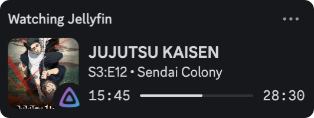
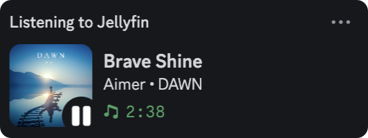
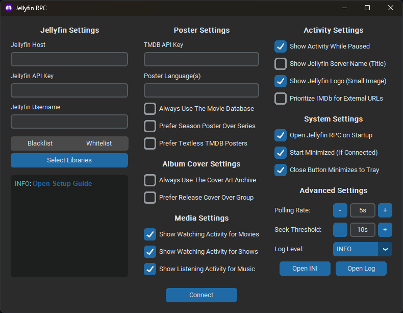

<!-- markdownlint-disable MD033 MD041 -->
# Discord RPC for Jellyfin

Jellyfin RPC updates your Discord status with what you're watching or listening to on your Jellyfin server. Make sure your desktop client for Discord is running and your [Activity Sharing](https://support.discord.com/hc/en-us/articles/7931156448919-Activity-Sharing-on-Discord-FAQ) settings are enabled.

<p align="center">
  
  
</p>

## Installation

- For the desktop GUI (Windows, macOS, or Linux), download the latest version from the [Releases](https://github.com/kennethsible/jellyfin-rpc/releases) page.
- For the CLI tool (headless/terminal), download the [INI file](https://github.com/kennethsible/jellyfin-rpc/blob/main/jellyfin_rpc.ini) from GitHub and install the package via [pip](https://pip.pypa.io/en/stable/installation/).

    ```bash
    pip install git+https://github.com/kennethsible/jellyfin-rpc.git
    ```

> [!NOTE]
> On Linux, [AppImageLauncher](https://github.com/TheAssassin/AppImageLauncher) can automatically create a desktop shortcut and place Jellyfin RPC into your system's application launcher.

## Configuration

Jellyfin host can be either a public or local URL for your server. However, posters and album covers won't be retrievable from your Jellyfin server with a local URL (requires HTTPS and must be publicly accessible by Discord). In that case, Jellyfin RPC includes support for public metadata providers such as [TMDB](https://www.themoviedb.org/) and [MusicBrainz](https://musicbrainz.org/) (via the [Cover Art Archive](https://coverartarchive.org/)).

After entering your Jellyfin host, click **Connect** and use [Quick Connect](https://jellyfin.org/docs/general/server/quick-connect/) to authenticate with a user access token. To generate an API key instead, go to the server dashboard and select **API Keys** under **Advanced**.

<p align="center">
  
</p>

If running in headless/CLI mode, configuration is loaded from an [INI file](https://github.com/kennethsible/jellyfin-rpc/blob/main/jellyfin_rpc.ini). If you encounter any issues, set the log level to `DEBUG` (via the GUI or INI file) and include the log output when opening a [GitHub issue](https://github.com/kennethsible/jellyfin-rpc/issues).

> [!NOTE]
> TMDB can *optionally* be used to fetch posters for movies and TV shows. However, you must create a [TMDB account](https://www.themoviedb.org/signup/) and generate an [API key](https://developer.themoviedb.org/docs/getting-started). The Cover Art Archive can be used to fetch album covers without an API key.

| Key | Default | Description |
| :--- | :--- | :--- |
| `JELLYFIN_HOST` | — | Jellyfin server URL (e.g., `https://jellyfin.example.com` or `http://localhost:8096`). |
| `JELLYFIN_API_KEY` | — | Jellyfin API key (generated automatically when authenticating with Quick Connect). |
| `JELLYFIN_USERNAME` | — | Jellyfin username to display media activity for in Discord. |
| `DISCORD_CLIENT_ID` | — | Optional custom Discord application client ID. Uses the provided application if unset. |
| `TMDB_API_KEY` | — | Optional API key from TMDB (required for posters if your Jellyfin server is local). |
| `MEDIA_TYPES` | `Shows, Movies, Music` | Comma-separated list of media types to display activities for (`Shows`, `Movies`, `Music`). |
| `SHOW_WHEN_PAUSED` | `true` | Shows the activity with a paused indicator instead of a progress bar. If disabled, the activity stops displaying when paused. |
| `SHOW_SERVER_NAME` | `false` | Shows your server name as the activity name instead of saying "Jellyfin". |
| `SHOW_JELLYFIN_LOGO` | `true` | Shows a small Jellyfin logo in the bottom right of the poster or album cover. |
| `POSTER_LANGUAGES` | — | Comma-separated list of languages (preferably two-letter [ISO 639-1](https://en.wikipedia.org/wiki/ISO_639-1) language codes) for TMDB. Uses TMDB's default image order if unset. |
| `TEXTLESS_POSTERS` | `false` | Controls whether textless TMDB posters are prioritized over language posters. |
| `ALWAYS_USE_TMDB` | `false` | Controls whether TMDB is the default source for posters or a fallback provider for local artwork from Jellyfin. |
| `SEASON_OVER_SERIES` | `false` | Controls whether season posters are preferred over series posters for shows. |
| `ALWAYS_USE_MUSICBRAINZ` | `false` | Controls whether MusicBrainz (via the Cover Art Archive) is the default source for album covers or a fallback provider for local artwork from Jellyfin. |
| `RELEASE_OVER_GROUP` | `false` | Controls whether [release](https://musicbrainz.org/doc/Release) artwork is preferred over [release group](https://musicbrainz.org/doc/Release_Group) artwork on MusicBrainz. |
| `FILTER_MODE` | `BLACKLIST` | Controls whether the library filter uses a whitelist (allowed) or blacklist (blocked). |
| `FILTER_LIBRARIES` | — | Comma-separated list of Jellyfin library IDs (the `topParentId` in the web client URL) to either whitelist or blacklist. |
| `POLLING_RATE` | `5` | Interval in seconds to poll Jellyfin sessions (or the minimum delay/fallback interval between WebSocket events). |
| `SEEK_THRESHOLD` | `10` | Playback jump in seconds required to resync Discord's elapsed timer when seeking. |
| `LOG_LEVEL` | `INFO` | Logging verbosity for the console (`DEBUG`, `VERBOSE`, `INFO`, `WARNING`, `ERROR`, `CRITICAL`). |
| `FILE_HDLR_LEVEL` | `DEBUG` | Logging verbosity for the log file (`DEBUG`, `VERBOSE`, `INFO`, `WARNING`, `ERROR`, `CRITICAL`). |
| `LOG_MAX_BYTES` | `5242880` | Maximum size in bytes of a log file before rotating to a new one (default is 5 MB). |
| `LOG_MAX_FILES` | `3` | Maximum number of log files to keep before deleting the oldest. |

## CLI Usage (Headless)

```bash
jellyfin-rpc [-h] [--ini-path INI_PATH] [--log-path LOG_PATH]

options:
  --ini-path INI_PATH
  --log-path LOG_PATH
```

If not specified, configuration and log files default to the following directories:

- `%AppData%\Jellyfin RPC` (Windows)
- `~/Library/Application Support/Jellyfin RPC` (macOS)
- `~/.config/jellyfin-rpc` (Linux)

## Building from Source

> [!NOTE]
> For Linux builds, refer to the PyInstaller GitHub Actions workflow ([see here](https://github.com/kennethsible/jellyfin-rpc/blob/main/.github/workflows/pyinstaller.yaml)) and use the system Python installation, as `uv` does not currently include font support ([astral-sh/uv/issues/15668](https://github.com/astral-sh/uv/issues/15668)).

1. Install the [uv](https://docs.astral.sh/uv/getting-started/installation/) package manager.

    ```bash
    curl -LsSf https://astral.sh/uv/install.sh | sh
    ```

2. Create a Python environment.

    ```bash
    uv venv .venv --python 3.12
    ```

3. Build the standalone executable.

    ```bash
    uv run --extra gui pyinstaller main.spec
    ```
