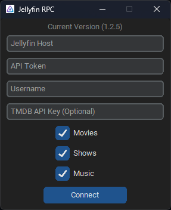

# Discord RPC for Jellyfin

Jellyfin RPC updates your Discord status with what you're watching or listening to on your Jellyfin server. Make sure your Discord client is open while using Jellyfin RPC.


## Installation

- Download [Latest Release](https://github.com/kennethsible/jellyfin-rpc/releases)
- Build from Source
   1. Install [uv](https://docs.astral.sh/uv/getting-started/installation/)
   2. Install Python<br>`uv install python`
   3. Create Python Environment<br>`uv sync --extra gui`
   4. Build Standalone Executable<br>`uv run pyinstaller main.spec`

## Configuration

To generate a Jellyfin API key, go to the server dashboard and select **API Keys** under **Advanced**.

- Jellyfin Host (e.g., <https://jellyfin.example.com>)
- Jellyfin API Key
- Jellyfin Username
- TMDB API Key (Optional)

If you prefer to use the CLI over the GUI (or you're on Linux), fill out the included [INI config](https://github.com/kennethsible/jellyfin-rpc/blob/main/jellyfin_rpc.ini). If you run into any issues, please change `log_level` in the INI to `DEBUG` and include the output in your GitHub Issue.

- `%AppData%\Jellyfin RPC`
- `~/Library/Application Support/Jellyfin RPC`

To fetch posters and album covers, your media must be properly tagged with the appropriate provider IDs.

> [!IMPORTANT]
> [**TMDB**](https://www.themoviedb.org/) is used to fetch posters for movies and TV shows. However, you must create a [TMDB account](https://www.themoviedb.org/signup/) and generate an [API key](https://developer.themoviedb.org/docs/getting-started). [**MusicBrainz**](https://musicbrainz.org/) and the [**Cover Art Archive**](https://coverartarchive.org/) are used to fetch album covers.

- `poster_languages` is a space- or comma-separated list of two-letter language codes ([ISO 639-1](https://en.wikipedia.org/wiki/ISO_639-1)) that indicates the preferred language(s) for TMDB posters.
- `season_over_series` controls whether season posters are preferred over series posters for shows.
- `release_over_group` controls whether release album covers are preferred over group album covers for music. The distinction between [release](https://musicbrainz.org/doc/Release) and [release group](https://musicbrainz.org/doc/Release_Group) is described in the MusicBrainz documentation. In short, a release is a specific version *or release* of an album that belongs to a *release group* (one per album).
- `find_best_match` searches for missing TMDB or MusicBrainz IDs before fetching posters or covers, respectively. Ideally, you should make sure that Jellyfin has populated these metadata tags.
- `show_when_paused` shows the rich presence with a paused timer instead of a progress bar. If disabled, the rich presence stops displaying when you pause your media.
- `show_server_name` shows your server name as the rich presence activity instead of saying Jellyfin.
- `show_jellyfin_icon` shows a small Jellyfin icon in the bottom right of the poster or album cover.

## Usage (GUI)




## Usage (CLI)

To install the CLI script, use `pip install git+https://github.com/kennethsible/jellyfin-rpc.git`

```bash
jellyfin-rpc [-h] --ini-path INI_PATH [--log-path LOG_PATH]
```
